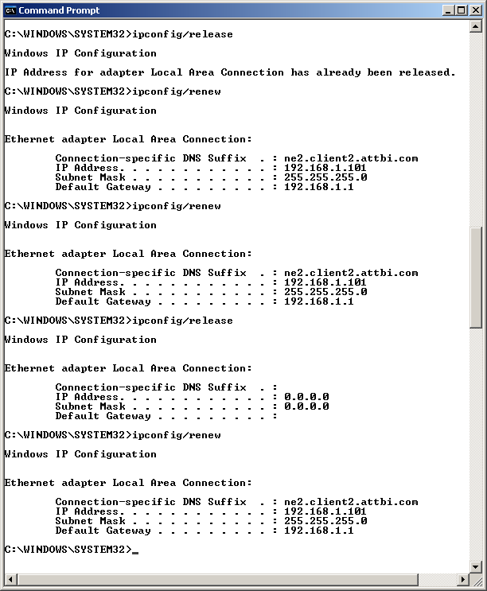
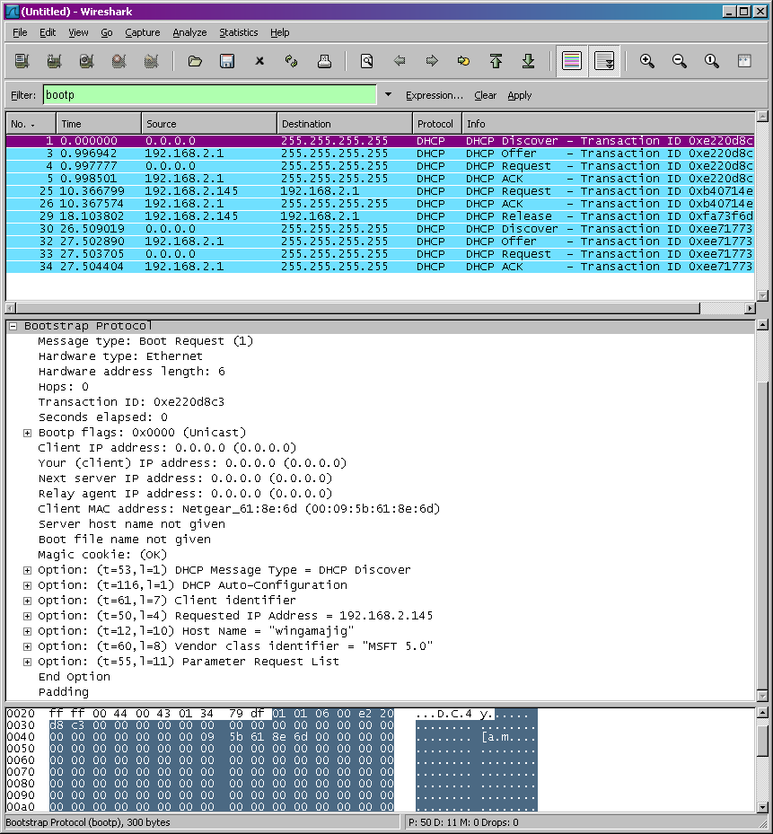

# Labs -- DHCP
Lab exercises in Networks.

### DHCP Protocol
In this lab, we’ll take a quick look at DHCP. DHCP is covered in Section 4.4.3 of the text . Recall that DHCP is used extensively in corporate, university and home-network wired and wireless LANs to dynamically assign IP addresses to hosts (as well as to configure other network configuration information).

This lab is brief, as we’ll only examine the DHCP packets captured by a host. If you also have administrative access to your DHCP server, you may want to repeat this lab after making some configuration changes (such as the lease time). If you have a router at home, you most likely can configure your DHCP server.  Because many linux/Unix machines (especially those that serve many users) have a static IP address and because manipulating DHCP on such machines typically requires super-user privileges, we’ll only present a Windows version of this lab below. 

DHCP Experiment

In order to observe DHCP in action, we’ll perform several DHCP-related commands and capture the DHCP messages exchanged as a result of executing these commands.  Do the following :

1.	Begin by opening the Windows Command Prompt application (which can be found in your Accessories folder). As shown in Figure 1, enter 
“ipconfig /release”. The executable for ipconfig is in C:\windows\system32. This command releases your current IP address, so that your host’s IP address becomes 0.0.0.0. 
2.	Start up the Wireshark packet sniffer, as described in the introductory Wireshark lab and begin Wireshark packet capture.
3.	Now go back to the Windows Command Prompt and enter “ipconfig /renew”. This instructs your host to obtain a network configuration, including a new IP address. In Figure 1, the host obtains the IP address 192.168.1.108
4.	Wait until the “ipconfig /renew” has terminated.  Then enter the same command “ipconfig /renew” again.
5.	When the second “ipconfig /renew” terminates, enter the command “ipconfig/release” to release the previously-allocated IP address to your computer. 
6.	Finally, enter “ipconfig /renew” to again be allocated an IP address for your computer.
7.	Stop Wireshark packet capture. 

 

 
Now let’s take a look at the resulting Wireshark window. To see only the DHCP packets, enter into the filter field “bootp”. (DHCP derives from an older protocol called BOOTP. Both BOOTP and DHCP use the same port numbers, 67 and 68. To see DHCP packets in the current version of Wireshark, you need to enter “bootp” and not “dhcp” in the filter.)
We see from Figure 2 that the first  ipconfig renew command caused four DHCP packets to be generated: a DHCP Discover packet, a DHCP Offer packet, a DHCP Request packet, and a DHCP ACK packet. 

 

Answer the following questions:

1.	Are DHCP messages sent over UDP or TCP? 
2.	Draw a timing datagram illustrating the sequence of the first four-packet Discover/Offer/Request/ACK DHCP  exchange between the client and server. For each packet, indicated the source and destination port numbers. Are the port numbers the same as in the example given in this lab assignment? 
3.	What is the link-layer (e.g., Ethernet) address of your host?
4.	What values in the DHCP discover message differentiate this message from the DHCP request message?
5.	What is the value of the Transaction-ID in each of the first four (Discover/Offer/Request/ACK) DHCP messages?  What are the values of the Transaction-ID in the second set (Request/ACK) set of DHCP messages?  What is the purpose of the Transaction-ID field?
6.	A host uses DHCP to obtain an IP address, among other things. But a host’s IP address is not confirmed until the end of the four-message exchange!  If the IP address is not set until the end of the four-message exchange, then what values are used in the IP datagrams in the four-message exchange?  For each of the four DHCP messages (Discover/Offer/Request/ACK DHCP), indicate the source and destination IP addresses that are carried in the encapsulating IP datagram.
7.	What is the IP address of your DHCP server?
8.	What IP address is the DHCP server offering to your host in the DHCP Offer message?  Indicate which DHCP message contains the offered DHCP address.
9.	In the example screenshot in this assignment, there is no relay agent between the host and the DHCP server. What values in the trace indicate the absence of a relay agent?  Is there a relay agent in your experiment? If so what is the IP address of the agent?
10.	Explain the purpose of the router and subnet mask lines in the DHCP offer message.
11.	In the DHCP trace file noted in footnote 2, the DHCP server offers a specific IP address to the client (see also question 8. above).  In the client’s response to the first server OFFER message, does the client accept this IP address?  Where in the client’s RESPONSE is the client’s requested address?
12.	Explain the purpose of the lease time. How long is the lease time in your experiment?
13.	What is the purpose of the DHCP release message?  Does the DHCP server issue an acknowledgment of receipt of the client’s DHCP request?  What would happen if the client’s DHCP release message is lost?
14.	Clear the bootp filter from your Wireshark window. Were any ARP packets sent or received during the DHCP packet-exchange period? If so, explain the purpose of those ARP packets.

