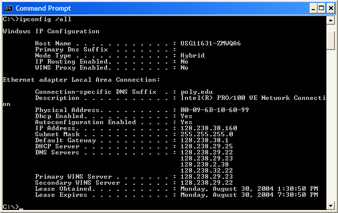
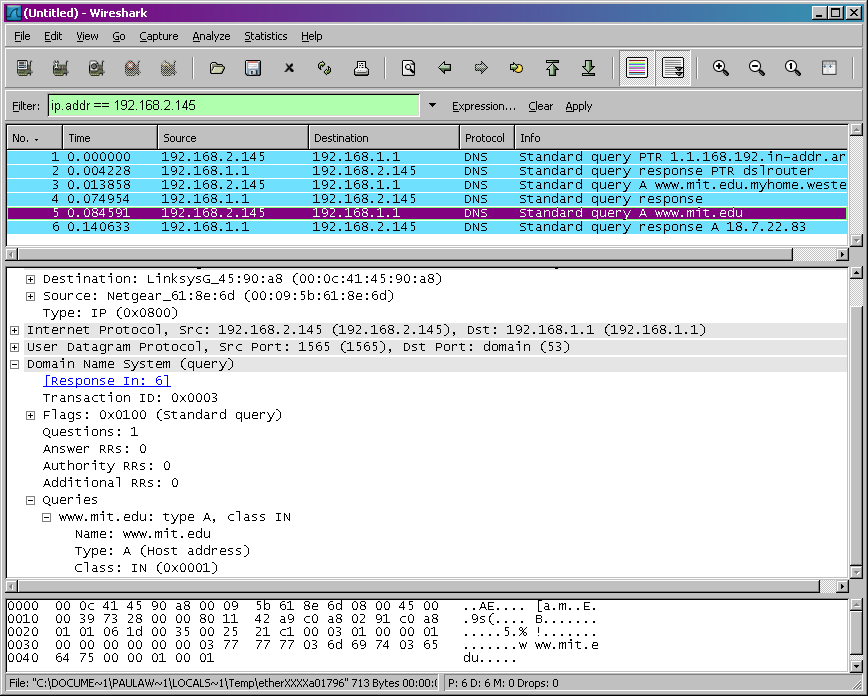

# Labs -- DNS

Lab exercises in Networks.

### DNS Protocol

|
Wireshark Lab:
DNS v8.0

Supplement to *Computer
Networking: A Top-Down Approach, 8th ed.,* J.F. Kurose and K.W.
Ross

As described in Section 2.4 of the text[[1]](#_ftn1),

the Domain Name System (DNS) translates hostnames to IP addresses, fulfilling a
critical role in the Internet infrastructure. In this lab, well take a closer
look at the client side of DNS. Recall that the client's role in the DNS is
relatively simple – a client sends a *query*
to its local DNS server, and receives a *response* back.  As shown in Figures 2.19 and 2.20
in the textbook, much can go on “under the covers,” invisible to the DNS clients,
as the hierarchical DNS servers communicate with each other to either
recursively or iteratively resolve the client’s DNS query.  From the DNS client’s standpoint, however,
the protocol is quite simple – a query is formulated to the local DNS server
and a response is received from that server.

Before beginning this lab, you’ll probably want to review
DNS by reading Section 2.4 of the text.
In particular, you may want to review the material on **local DNS servers**, **DNS caching**, **DNS records and
messages**, and the **TYPE field** in
the DNS record.

1. nslookup

In this lab, we’ll make extensive use of the *nslookup* tool, which is available in most Linux/Unix and Microsoft platforms today. To
run *nslookup* in Linux/Unix, you just type the *nslookup* command on
the command line. To run it in Windows, open the Command Prompt and run *nslookup*
on the command line.

In it is most basic operation, *nslookup* tool allows
the host running the tool to query any specified DNS server for a DNS record.
The queried DNS server can be a root DNS server, a top-level-domain DNS server,
an authoritative DNS server, or an intermediate DNS server (see the textbook
for definitions of these terms). To accomplish this task, *nslookup* sends
a DNS query to the specified DNS server, receives a DNS reply from that same
DNS server, and displays the result.

 In this example, the client
host is located on the campus of Polytechnic University in Brooklyn, where the
default local DNS server is dns-prime.poly.edu. When running *nslookup*,
if no DNS server is specified, then *nslookup* sends the query to the
default DNS server, which in this case is dns-prime.poly.edu. Consider the first
command:

nslookup www.mit.edu

In words, this command is saying “please send me the IP
address for the host www.mit.edu”. As shown in the screenshot, the response
from this command provides two pieces of information: (1) the name and IP
address of the DNS server that provides the answer; and (2) the answer itself,
which is the host name and IP address of www.mit.edu. Although the response
came from the local DNS server at Polytechnic University, it is quite possible
that this local DNS server iteratively contacted several other DNS servers to
get the answer, as described in Section 2.4 of the textbook.

Now consider the second command:

nslookup –type=NS mit.edu

In this example, we have provided the option “-type=NS” and
the domain “mit.edu”. This causes *nslookup* to send a query for a type-NS
record to the default local DNS server. In words, the query is saying, “please
send me the host names of the authoritative DNS for mit.edu”. (When the –type
option is not used, *nslookup* uses the default, which is to query for
type A records.) The answer, displayed in the above screenshot, first indicates
the DNS server that is providing the answer (which is the default local DNS
server) along with three MIT nameservers. Each of these servers is indeed an
authoritative DNS server for the hosts on the MIT campus. However, *nslookup*
also indicates that the answer is “non-authoritative,” meaning that this answer
came from the cache of some server rather than from an authoritative MIT DNS
server. Finally, the answer also includes the IP addresses of the authoritative
DNS servers at MIT. (Even though the type-NS query generated by *nslookup*
did not explicitly ask for the IP addresses, the local DNS server returned
these “for free” and *nslookup* displays the result.)

Now finally consider the third command:

nslookup
www.aiit.or.kr bitsy.mit.edu

In this example, we indicate that we want to the query sent
to the DNS server bitsy.mit.edu rather than to the default DNS server
(dns-prime.poly.edu). Thus, the query and reply transaction takes place
directly between our querying host and bitsy.mit.edu. In this example, the DNS
server bitsy.mit.edu provides the IP address of the host www.aiit.or.kr, which
is a web server at the Advanced Institute of Information Technology (in Korea).

Now that we have gone through a few illustrative examples,
you are perhaps wondering about the general syntax of *nslookup* commands.
The syntax is:

nslookup –option1
–option2 host-to-find dns-server

In general, *nslookup* can be run with zero, one, two
or more options. And as we have seen in the above examples, the dns-server is
optional as well; if it is not supplied, the query is sent to the default local
DNS server.

Now that we have provided an overview of *nslookup*, it
is time for you to test drive it yourself. Do the following (and write down the
results):

1. Run*nslookup*
   to obtain the IP address of a Web server in Asia. What is the IP address
   of that server?
2. Run*nslookup*
   to determine the authoritative DNS servers for a university in Europe.
3. Run*nslookup*
   so that one of the DNS servers obtained in Question 2 is queried for the
   mail servers for Yahoo! mail.   What
   is its IP address?
4.

ipconfig

*ipconfig* (for Windows) and *ifconfig* (for
Linux/Unix) are among the most useful little utilities in your host, especially
for debugging network issues. Here we’ll only describe *ipconfig*,
although the Linux/Unix *ifconfig* is very similar. *ipconfig* can be
used to show your current TCP/IP information, including your address, DNS
server addresses, adapter type and so on. For example, if you all this
information about your host simply by entering

ipconfig \all

into the Command Prompt, as shown in the following
screenshot.

*ipconfig* is also very useful for managing the DNS
information stored in your host. In Section 2.5 we learned that a host can
cache DNS records it recently obtained. To see these cached records, after the
prompt C:\> provide the following command:

<pre>ipconfig /displaydns<o:p></o:p></pre>

Each entry shows the remaining Time to Live (TTL) in seconds. To clear the
cache, enter

<pre>ipconfig /flushdns<o:p></o:p></pre>

Flushing the DNS cache clears all entries and reloads the entries from the
hosts file.

# 3. Tracing DNS with Wireshark

Now that we are familiar with *nslookup* and *ipconfig*,
we’re ready to get down to some serious business. Let’s first capture the DNS
packets that are generated by ordinary Web-surfing activity.

·
Use *ipconfig* to empty the DNS cache in
your host.

·
Open your browser and empty your browser cache.
(With Internet Explorer, go to Tools menu and select Internet Options; then in
the General tab select Delete Files.)

·
Open Wireshark and enter “ip.addr ==
your_IP_address” into the filter, where you obtain your_IP_address with
ipconfig. This filter removes all packets that neither originate nor are
destined to your host.

·
Start packet capture in Wireshark.

·
With your browser, visit the Web page:
http://www.ietf.org

·
Stop packet capture.

If you are unable to run Wireshark on a live network
connection, you can download a packet trace file that was captured while
following the steps above on one of the author’s computers[[2]](#_ftn2).  Answer the following questions. Whenever
possible, when answering a question below, you should hand in a printout of the
packet(s) within the trace that you used to answer the question asked.  Annotate the printout[[3]](#_ftn3) to
explain your answer. To print a packet, use *File->Print*,
choose *Selected packet only*, choose *Packet summary line,* and select the
minimum amount of packet detail that you need to answer the question.

4. Locate
   the DNS query and response messages. Are then sent over UDP or TCP?
5. What
   is the destination port for the DNS query message? What is the source port
   of DNS response message?
6. To
   what IP address is the DNS query message sent? Use ipconfig to determine
   the IP address of your local DNS server. Are these two IP addresses the
   same?
7. Examine
   the DNS query message. What “Type” of DNS query is it? Does the query
   message contain any “answers”?
8. Examine
   the DNS response message. How many “answers” are provided? What do each of
   these answers contain?
9. Consider
   the subsequent TCP SYN packet sent by your host. Does the destination  IP address of the SYN packet correspond
   to any of the IP addresses provided in the DNS response message?
10. This
    web page contains images. Before retrieving each image, does your host
    issue new DNS queries?

Now let’s play with *nslookup*[[4]](#_ftn4).

·
Start packet capture.

·
Do an *nslookup* on www.mit.edu

·
Stop packet capture.

* *

We see from the above screenshot that *nslookup*
actually sent three DNS queries and received three DNS responses. For the
purpose of this assignment, in answering the following questions, ignore the
first two sets of queries/responses, as they are specific to *nslookup*
and are not normally generated by standard Internet applications. You should
instead focus on the last query and response messages.

11. What
    is the destination port for the DNS query message? What is the source port
    of DNS response message?
12. To
    what IP address is the DNS query message sent? Is this the IP address of
    your default local DNS server?
13. Examine
    the DNS query message. What “Type” of DNS query is it? Does the query
    message contain any “answers”?
14. Examine
    the DNS response message. How many “answers” are provided? What do each of
    these answers contain?
15. Provide
    a screenshot.

Now repeat the previous experiment, but instead issue the
command:

nslookup –type=NS mit.edu

Answer the following questions[[5]](#_ftn5) :

16. To
    what IP address is the DNS query message sent? Is this the IP address of
    your default local DNS server?
17. Examine
    the DNS query message. What “Type” of DNS query is it? Does the query
    message contain any “answers”?
18. Examine
    the DNS response message. What MIT nameservers does the response message
    provide? Does this response message also provide the IP addresses of the
    MIT namesers?
19. Provide
    a screenshot.

Now repeat the previous experiment, but instead issue the
command:

nslookup
www.aiit.or.kr bitsy.mit.edu

Answer the following questions[[6]](#_ftn6):

20. To
    what IP address is the DNS query message sent? Is this the IP address of
    your default local DNS server? If not, what does the IP address correspond
    to?
21. Examine
    the DNS query message. What “Type” of DNS query is it? Does the query
    message contain any “answers”?
22. Examine
    the DNS response message. How many “answers” are provided? What does each
    of these answers contain?
23. Provide
    a screenshot.

---

[[1]](#_ftnref1)
References to figures and sections are for the 8th edition of our
text, *Computer Networks, A Top-down
Approach, 8th ed., *J.F. Kurose and K.W. Ross,
Addison-Wesley/Pearson, 2020.**

[[2]](#_ftnref2) Download
the zip file [http://gaia.cs.umass.edu/wireshark-labs/wireshark-traces.zip](http://gaia.cs.umass.edu/wireshark-labs/wireshark-traces.zip)and
extract the file dns-ethereal-trace-1. The traces in this zip file were
collected by Wireshark running on one of the author’s computers, while
performing the steps indicated in the Wireshark lab. Once you have downloaded
the trace, you can load it into Wireshark and view the trace using the *File* pull down menu, choosing *Open*, and then selecting the dns-ethereal-trace-1
trace file.

[[3]](#_ftnref3) What do
we mean by “annotate”?  If you hand in a
paper copy, please highlight where in the printout you’ve found the answer and
add some text (preferably with a colored pen) noting what you found in what you
‘ve highlight.  If you hand in an
electronic copy, it would be great if you could also highlight and annotate.

[[4]](#_ftnref4) If you
are unable to run Wireshark and capture a trace file, use the trace file
dns-ethereal-trace-2 in the  zip file [http://gaia.cs.umass.edu/wireshark-labs/wireshark-traces.zip](http://gaia.cs.umass.edu/wireshark-labs/wireshark-traces.zip)

[[5]](#_ftnref5) If you
are unable to run Wireshark and capture a trace file, use the trace file
dns-ethereal-trace-3 in the  zip file [http://gaia.cs.umass.edu/wireshark-labs/wireshark-traces.zip](http://gaia.cs.umass.edu/wireshark-labs/wireshark-traces.zip)

[[6]](#_ftnref6) If you
are unable to run Wireshark and capture a trace file, use the trace file
dns-ethereal-trace-4 in the  zip file [http://gaia.cs.umass.edu/wireshark-labs/wireshark-traces.zip](http://gaia.cs.umass.edu/ethereal-labs/ethereal-traces.zip)
