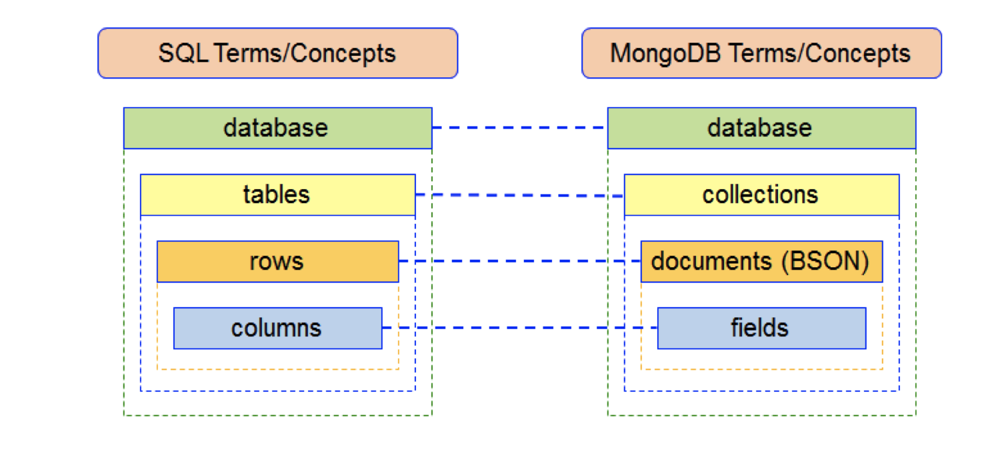

# Lab Databases
Lab exercises. Introduction to Information Technology. Databases. Based on Sullivan, Dan. NoSQL for mere mortals. 

This course of the Khan Academy teaches how to create your own database:
https://www.khanacademy.org/computing/hour-of-code/hour-of-sql/pp/project-design-a-store-database

The school library provides several books as online resources. You can access them through the library databases link: https://www.himolde.no/bibliotek/english/databases/ in the Database Ebook Central ProQuest - E-books in full text. 

We are not going to delve into the details of Database design because you are going to have a course in Databases on the next semester. In this class we will show you what you can do with databases. At the end of this class you will be able to create a simple database and use it in your project.

Objective: This is a hands-on lab on Databases. We will use the playgrounds in:
https://www.khanacademy.org/computer-programming/spin-off-of-project-design-a-store-database/
for a relational database and:
https://docs.mongodb.com/manual/tutorial/query-documents/
for MongoDB (a NoSQL database).

## My first Relational database
Let's start creating a table in our playground using SQL.

Creating a table and inserting data:
https://www.khanacademy.org/computing/computer-programming/sql/sql-basics/pc/challenge-book-list-database

Querying the table:
https://www.khanacademy.org/computing/computer-programming/sql/sql-basics/pc/challenge-box-office-hits-database

Agregating data:
https://www.khanacademy.org/computing/computer-programming/sql/sql-basics/pt/aggregating-data

Linking tables (foreign key):
```sql
CREATE TABLE items (id INTEGER PRIMARY KEY, name TEXT, price REAL DEFAULT 10);

INSERT INTO items (id, name) VALUES (1, "bici");
INSERT INTO items (id, name, price) VALUES (2, "patin",5);
INSERT INTO items (id, name) VALUES (3, "carro");

CREATE TABLE sold (
    id INTEGER,
    amount INTEGER DEFAULT 1,
    FOREIGN KEY(id) REFERENCES items(id));

INSERT INTO sold (id, amount) VALUES (3, 4);

SELECT * FROM items, sold WHERE items.id = sold.id
```

Safer SQL:
https://www.khanacademy.org/computing/computer-programming/sql/modifying-databases-with-sql/pc/challenge-dynamic-documents
```sql
CREATE table documents (
    id INTEGER PRIMARY KEY AUTOINCREMENT,
    title TEXT,
    content TEXT,
    author TEXT);
    
INSERT INTO documents (author, title, content)
    VALUES ("Puff T.M. Dragon", "Fancy Stuff", "Ceiling wax, dragon wings, etc.");
INSERT INTO documents (author, title, content)
    VALUES ("Puff T.M. Dragon", "Living Things", "They're located in the left ear, you know.");
INSERT INTO documents (author, title, content)
    VALUES ("Jackie Paper", "Pirate Recipes", "Cherry pie, apple pie, blueberry pie.");
INSERT INTO documents (author, title, content)
    VALUES ("Jackie Paper", "Boat Supplies", "Rudder - guitar. Main mast - bed post.");
INSERT INTO documents (author, title, content)
    VALUES ("Jackie Paper", "Things I'm Afraid Of", "Talking to my parents, the sea, giant pirates, heights.");

SELECT * FROM documents;

BEGIN TRANSACTION;
    UPDATE documents SET author = "Jackie Draper"
    WHERE author="Jackie Paper";
COMMIT;

SELECT * FROM documents;
```

## NoSQL databases:
The most widely used types of NoSQL databases are:
- Key-Value pair: DynamoDB, LevelDB, Riak, Tokyo/Kyoto Cabinet, Oracle NoSQL DB
- Document: MongoDB, CouchDB
- Column family store: Hypertable. MariaDB, Apache HBase
- Graph Databases: Neo4J, DEX, GraphBase, GraphChi

Lets play with the MongoDB database. MongoDB is a document-based NoSQL database. It can be related to SQL as shown in the figure:
 (from https://www.freecodecamp.org/news/learn-mongodb-a4ce205e7739/
)

You may use the playground available here:
https://docs.mongodb.com/manual/tutorial/query-documents/

### Tasks:
1. Create a new database inventory (use inventory)
2. Insert a new collection myinventory into inventory with the following documents (you may change them as you like):
```mongodb
db.myinventory.insertMany([
   { item: "journal", qty: 25, size: { h: 14, w: 21, uom: "cm" }, status: "A" },
   { item: "notebook", qty: 50, size: { h: 8.5, w: 11, uom: "in" }, status: "A" },
   { item: "paper", qty: 100, size: { h: 8.5, w: 11, uom: "in" }, status: "D" },
   { item: "planner", qty: 75, size: { h: 22.85, w: 30, uom: "cm" }, status: "D" },
   { item: "postcard", qty: 45, size: { h: 10, w: 15.25, uom: "cm" }, status: "A" }
]);
```
3. Retrieve all the documents in the collection
4. Retrieve ll the documents with a particular field value

## Optional. Geospatial databases.

Let's go for something more interesting. In order to install MongoDB you can go through the steps in:
http://www.dba86.com/docs/mongo/2.4/installation.html
In the Mac you can install it from here:
curl -O http://downloads.mongodb.org/osx/mongodb-osx-x86_64-2.4.14.tgz

untar as:
tar xvf nameofthefile.tar

then: 
cd nameofthefolder
cd bin

There execute the daemon:
mkdir data
./mongodbd --dbpath data & 
and the mongo executable
./mongo

Download this file: (US zip code data set)
https://media.mongodb.org/zips.json

**JavaScript Object Notation (JSON) is an open-standard language-independent data format that uses human-readable text to transmit data objects consisting of attribute–value pairs and other serializable values.**

Now you can follow these steps: https://docs.mongodb.com/manual/tutorial/aggregation-zip-code-data-set/

<!--https://dduril.github.io/ucscx-data-analytics/nosql-databases/lab-3b.html-->

If you want to see points in the map using the json format, you might want to use this tool: http://geojsonlint.com/
and this guide:
http://tugdualgrall.blogspot.com/2014/08/introduction-to-mongodb-geospatial.html

<!--### Key-Value pair databases
Introduction to the technology: explain the data model (what makes all the systems in the class similar)-->
<!--Gives an assessment of the types of workloads for which it is and is not well-suited.-->
<!--Compares several of the specific products in the class, contrasting the things that are different between systems.-->

!--MongoDB Atlas https://www.youtube.com/watch?v=leNNivaQbDY
https://docs.mongodb.com/manual/faq/fundamentals/#how-do-i-create-a-database-and-a-collection
Design a database-->

