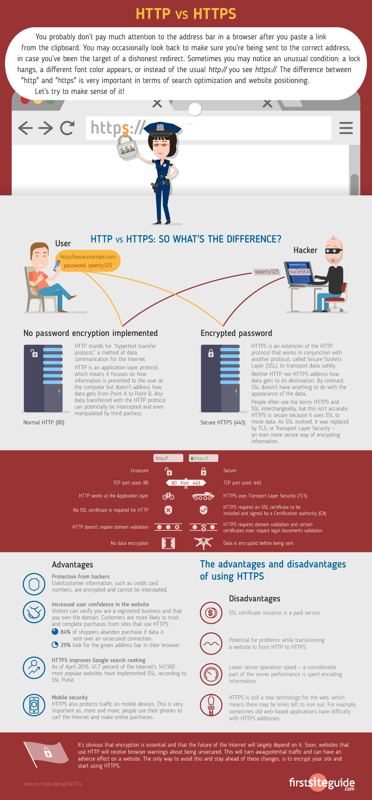
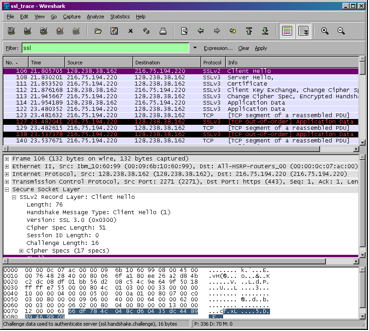

## Cryptographic hash functions:
A cryptographic hash function (https://en.wikipedia.org/wiki/Cryptographic_hash_function) maps an arbitrarily sized (message) entry to a string of fixed length bits, called a hash digest or digest. An ideal cryptographic hash function should be:
1. unidirectional: it is impossible to retrieve a message given a hash, unless all possible messages are tested;
2. deterministic: the same input always generates the same output;
3. numerically unstable: a small change in input generates a drastic change in output;
4. No collisions: Given the size difference between the input and output two different messages can produce a collision, but finding such a collision should be computationally unfeasible.

### Question 1: Practice the validity of these properties in the SHA256 algorithm. 
In this exercise you can use the website https://anders.com/blockchain/hash . In that page you have a text block where you may write text and see the value returned by the SHA256 function when applied to that text.
Write a text inside the text block and see how the string below changes. Also note that the hash output in this function is always 256 bits long.

### MD5: RFC 1321: The MD5 message-digest algorithm
The algorithm takes as input a message of arbitrary length and produces as 128-bit output "fingerprint" or "message digest" of the input. It is conjectured that it is computationally infeasible to produce two messages having the same message digest, or to produce any message having a given prespecified target message digest. (https://tools.ietf.org/html/rfc1321)
In this lab we will be using the MD5, SHA and SHA256 algorithms implemented in the Python Cryptography Toolkit (Package Crypto): collection of cryptographic modules that implement various functions and algorithms.
Documentation: https://pypi.python.org/pypi/pycrypto/2.6. Python: http://docs.python-guide.org/en/latest/scenarios/crypto/

### Question 2: Reversing hashes
Try using CrackStation.net to reverse the next secret hashes. Inspect and verify that the size of the output is correct by  referring to this table:

hash function | output size
--------------|------------
MD5           | 128 bits
SHA           | 160 bits
SHA256        | 256 bits

whether the hash function was MD5, SHA or SHA256.

```
6655fcfadca4adff9933c07842161c65f993c9bd
201b8f20dd1695d7d46e80a23f0487d1cb91e255
460b8dde3c375c9f9b87e3ab44ffce3fa1305744
97ea5599536ab294f94a47c4194c2c6d488d2725
fa0754b9861f7065fd7c6270efb07fc6ac3b0ad8
```
(Hint: they use brute force and a dictionary)

Now try reversing the hashes of passwords here: https://crackstation.net/. 
```
7ab9495396df849963e683d724f85086
88b4ce63d49305ffd3570c7c24c0c5b0
66ce76c7795eb6325705fb6efe0afc1d
90f441eed2c426e09ae41eb53095623e
5e815814b6c62056f25078ef388f1b53
```

Did it work? Need to add the **salt**! 
One way to avoid precomputed tables is to use the mechanism of salting. One of the characteristics of hashing algorithms is that they are numerically unstable: a small change in input generates a drastic change in output. In salting a string (salt) is added a prefix to the message before computing the hash. In this case, salts are representations of integers as strings. 
The site HashKiller.co.uk (now moved to hashkiller.io) have collected passwords since 2007. What they do is just look for the password in a table they have built. 
Try again to reverse the hashes using the site https://hashes.com/en/decrypt/hash, and verify that the salt correspondent to each of the following passwords is as follows:

```
7ab9495396df849963e683d724f85086,632
88b4ce63d49305ffd3570c7c24c0c5b0,470
66ce76c7795eb6325705fb6efe0afc1d,101
90f441eed2c426e09ae41eb53095623e,642
5e815814b6c62056f25078ef388f1b53,987
```

## Encryption
Hash functions work well for authentication applications because they are unidirectional, making the message unintelligible. For bidirectional applications (such as message exchange) where it is desirable to retrieve the message in its original format, encryption algorithms - or **ciphers** - are commonly used. Encryption is used to prevent the content of messages intercepted during a communication from being understood by unauthorized entities. To this end, the two entities involved in the communication use additional information (keys) that allow to encrypt and decrypt messages. Encryption algorithms can be **symmetric**, where the encryption and decryption keys are the same, or asymmetric otherwise. In block-level algorithms, messages are processed in blocks, while in stream algorithms, operations are done byte by byte.

(From https://en.wikipedia.org/wiki/XOR_cipher#Example_implementation)
This is its XOR function table:

a | b | a ⊕ b
--|---|------
0 | 0 | 0
0 | 1 | 1
1 | 0 | 1
1 | 1 | 0

where ⊕ denotes the exclusive disjunction (XOR) operation. This operand will compare two bits and will produce one bit in return.

In cryptography, the simple XOR cipher is a type of additive cipher, an **encryption algorithm** that operates according to the principles:
```
    A ⊕ 0 = A,
    A ⊕ A = 0,
    (A ⊕  B) ⊕ C = A ⊕ (B ⊕ C),
    (B ⊕ A) ⊕ A = B ⊕ 0 = B,
```
With this logic, a string of text can be encrypted by applying the bitwise XOR operator to every character using a given key. To decrypt the output, merely reapply the XOR function with the key to remove the cipher.
When the key is smaller than the input, you reapply it until you reach the end of input. 
XOR cracking is often based on frequency analysis. 

### Exercise 3: XOR encryption
Open the site http://xor.pw/# . Test the properties of the XOR cipher by encrypting a text and decrypting the output. In particular, verify that: (B ⊕ A) ⊕ A = B ⊕ 0 = B

## Asymmetric cryptography
The RSA algorithm is an asymmetric encryption algorithm. Also called public-key encryption, uses two separate keys: one **public** to encrypt and one **private** to decrypt. Anyone in possession of the public key can encrypt a message that only the proven private key owner can read. RSA was the first algorithm that demonstrated this concept. Its security assumptions are based on complexity theory: calculating the product of two prime numbers is easy (polynomial time), but there is no efficient algorithm for factoring them back.You can  Choose diferent sizes for your keys (the longer, the safer) as you can see here: https://8gwifi.org/rsafunctions.jsp but remember that the assimetric cryptography is computationally demanding, thus your encryption/decryptio will be much slower with longer keys. 

### Exercise 4: RSA encryption
Enter the site:
http://cobweb.cs.uga.edu/~dme/csci6300/Encryption/Crypto.html
Generate a pair of keys and use them to encrypt and decrypt a message. Verify that a message encrypted with a public key can only be decrypted with its private key, and viceversa.

See more about encryption here:
https://www.khanacademy.org/computing/computer-science/cryptography/modern-crypt/v/rsa-encryption-part-4

# Secure Layer over HTTP
What you should know to understand this part of the lab? 
* What is a POST method: https://www.w3schools.com/tags/ref_httpmethods.asp
* Difference between HTTP and HTTPS 

 
(taken from https://www.globalsign.com/en/blog/the-difference-between-http-and-https/)

### Exercise: HTTP-based authentication. 
In the browser, access the page:
http://my-static-test01.herokuapp.com/form.html

1) Start a new packet capture on Wireshark. Enter a fictitious user and password on the page. Click the Submit button and wait for the answer page.
2) Stop packet capture. **You have sent username and password data through the HTTP POST packet!!**. 
Click on the line **POST /answer.php HTTP/1.1**. In the middle screen, click **⊳ HTML Form URL Encoded** to expand the information. Observe:
  a) Can you find the login and password information entered in the previous item?
  b) Is HTTP authentication secure? Why?

## Wireshark Lab: TLS/SSL (in what follows, when we use SSL we are refering to TLS or SSL, depending of which one is in use in the server)
Supplement to Computer Networking: A Top-Down Approach, 7th ed., J.F. Kurose and K.W. Ross
© 2005-2016, J.F Kurose and K.W. Ross, All Rights Reserved	 

In this lab, we’ll investigate the Secure Sockets Layer (SSL) protocol, focusing on the SSL records sent over a TCP connection. We’ll do so by analyzing a trace of the SSL records sent between your host and an a server. We’ll investigate the various SSL record types as well as the fields in the SSL messages.   You may want to review Section 8.6 in the text (available [here](https://www.google.com/url?sa=t&rct=j&q=&esrc=s&source=web&cd=8&cad=rja&uact=8&ved=2ahUKEwjfipPQgs7lAhWFxcQBHVbZD6QQFjAHegQICBAC&url=http%3A%2F%2Fce.sharif.edu%2Fcourses%2F94-95%2F2%2Fce443-3%2Fresources%2Froot%2FBook%2Ffqo47.Computer.Networking.A.TopDown.Approach.6th.Edition.pdf&usg=AOvVaw1_FFqF_DWRt9aDVZ_C8AT-)).



1. Capturing packets in an SSL session

The first step is to capture the packets in an SSL session. To do this, you should go to a site that uses HTTPS (look for the lock!, ex. an e-commerce site that you use or any site that uses TLS/SSL where you have a login). Login and navigate for some time in the site. After capturing the packets with Wireshark, you should set the filter so that it displays only the Ethernet frames that contain SSL records sent from and received by your host. (An SSL record is the same thing as an SSL message.) You should obtain something like screenshot on the previous page.

2.  A look at the captured trace

Your Wireshark GUI should be displaying only the Ethernet frames that have SSL records. It is important to keep in mind that an Ethernet frame may contain one or more SSL records. (This is very different from HTTP, for which each frame contains either one complete HTTP message or a portion of a HTTP message.) Also, an SSL record may not completely fit into an Ethernet frame, in which case multiple frames will be needed to carry the record.

1.	Look for a ClientHello Record. Starting there, for each of the first  8 Ethernet frames displayed, specify the source of the frame (client or server), determine the number of SSL records that are included in the frame, and list the SSL record types that are included in the frame with the value of the "content type" field. Draw a timing diagram between client and server, with one arrow for each SSL record. 

ClientHello Record:

2.	Expand the ClientHello record. (If your trace contains multiple ClientHello records, expand the frame that contains the first one.) What is the value of the content type?
<!--3.	Does the ClientHello record contain a nonce (also known as a “challenge”)? If so, what is the value of the challenge in hexadecimal notation?-->
3.	Does the ClientHello record advertise the cipher suites it supports? If so, pick one of the listed suites, and identify the public-key algorithm, the symmetric-key algorithm, and the hash algorithm.

ServerHello Record:

4.	Locate the ServerHello SSL record: Does this record specify a chosen cipher suite? What are the algorithms in the chosen cipher suite?
5.	Does this record contain a certificate, or is the certificate included in a separate record? What was the encryption used for the signature of the certificate? (Look for it inside the TLS/SSL record)

6. After the Client Key Exchange Record is sent, the Application Data messages are sent open or encrypted? What do you think is the encryption scheme used from now on? 
7. Is it possible to read the login and password you have entered in the site?

<!--
Client Key Exchange Record:
10.	Locate the client key exchange record. Does this record contain a pre-master secret? What is this secret used for? Is the secret encrypted? If so, how? How long is the encrypted secret?
Change Cipher Spec Record (sent by client) and Encrypted Handshake Record: 
11.	What is the purpose of the Change Cipher Spec record? How many bytes is the record in your trace? 
12.	In the encrypted handshake record, what is being encrypted? How?
13.	Does the server also send a change cipher record and an encrypted handshake record to the client? How are those records different from those sent by the client?-->

<!--Application Data
14.	How is the application data being encrypted? Do the records containing application data include a MAC? Does Wireshark distinguish between the encrypted application data and the MAC? 
15.	Comment on and explain anything else that you found interesting in the trace. 
-->
Note: https://security.stackexchange.com/questions/3664/ssl-replay-attack-when-client-server-random-is-missing?rq=1

## SQL Injection attack
https://xkcd.com/327/

Follow the steps in https://www.guru99.com/learn-sql-injection-with-practical-example.html

https://www.w3resource.com/sql/sql-injection/sql-injection.php

https://portswigger.net/web-security/sql-injection

https://owasp.org/www-community/attacks/SQL_Injection


