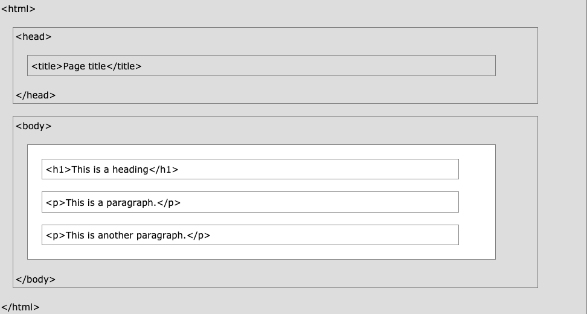
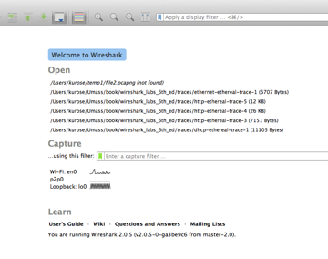
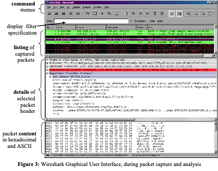
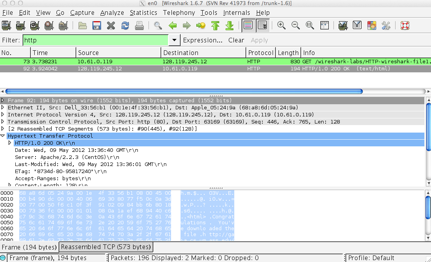

# Labs
Lab exercises. Introduction to Information Technology. Networking. Based on *Supplement Material to the book Computer Networking: A Top-Down Approach, 7th ed., J.F. Kurose and K.W. Ross, https://www.w3schools.com/whatis/whatis_html.asp, Edx course HTML5 and CSS Fundamentals*
The school library provides several books about Wireshark as online resources. You can access them through the library databases link: https://www.himolde.no/bibliotek/english/databases/ in the Database Ebook Central ProQuest - E-books in full text. For instance, you can read "Practical Packet Analysis : Using Wireshark to Solve Real-World Network Problems", by Chris Sanders.

One's understanding of network protocols can often be greatly deepened by "seeing protocols in action" and by "playing around with protocols" - observing the sequence of messages exchanges between two protocol entities, delving down into the details of protocol operation, and causing protocols to perform certain actions and then observing these actions and their consequences. In these Wireshark labs, we will do it in a real network environment. 

You will create a Web page and verify what happens when you ask the Web client (your browser) to access it through the network. The objective in this lab is that you observe and learn by doing.

The Web is an information system where resources are identified by URLs and can be accessed via the HTTP protocol. It is based on 3 technologies: 
- the Hypertext Transfer Protocol (HTTP): the underlying protocol used by the World Wide Web that defines how messages are formatted and transmitted, and what actions Web servers and clients (browsers) should take in response to a message received. 
- The Hypertext Markup Language (HTML). It is the markup language we use to write documents that can be displayed in a Web browser.  The current HTML version is HTML5. Modern Web pages and Web applications are generally composed of at least three components, so what people often mean when they say 'HTML5' is the trio of languages: HTML5, CSS3 and JavaScript.
  - The 'HTML' part contains all the content, organized into a logical structure.  This is the part that an author might be most concerned with: the words, chapter headings, figures, diagrams, etc. HTML5 was developed to provide more powerful and flexible ways for developers to create dynamic Web pages.
  - The 'CSS' part (version 3 being current) is all about the presentation or style of the page; what it looks like without too much regard for the specific content. You may think of it as the way you might specify a "theme" in a word processing document, setting fonts, sizes, indentations and whatever else may apply to what it looks like. 
  - The 'JavaScript', or 'JS' for short, part is about the actions a page can take such as interaction with the user, and customizing and changing the page according to any number of parameters.  This is what allows a Web page to be more than just a document, but potentially a Web application. 
- A Uniform Resource Locator (URL) allows to refer to a Web resource (web pages, images, etc), specifying its location on a computer network and a mechanism for retrieving it.

## My first Web page.
In this part of the lab you are going to create your first HTML page. 
You can build and edit your HTML pages by either using online editors or editors that you can install on your machine like Visual Studio Code. 

Using online editors:
JSBin is an online editor that you can use to create HTML Web pages available at  https://jsbin.com/?html,output

This is a valid html file. You can find it here: https://himolde-ibe110.github.io/Labs/hello.html) When you open it on your browser, it will show the contents of the page. You will see just a "Hello Word!" sentence. If the toolbar of your browser is visible, you will see also the title of the page as "My First HTML Page". If you right click on the page and choose See the source code of the page, you should see this:
```html
<!DOCTYPE html>
<html>
<head>
  <meta charset="utf-8">
  <meta name="viewport" content="width=device-width">
  <title>My First HTML Page</title>
</head>
<body>
    Hello Word!
</body>
</html>
```
The .html extension tells me this is a HTML file, and it will contain some HTML code. 
You can see that this is a simple file, it is just showing the text hello html. and it also changes the title of
the page to be my first HTML page. So there you have it, a very simple HTML page.
Let's now go to an online tool(https://jsbin.com/) and try to create this page from scratch.

Open up a new tab and go to jsbin.com. We will use the free version, no need to login or register. We will use the site just as a playground to create a simple HTML page. We'll have a quick look around the layout of the site.
Here you can see there's a panel on the left which is a HTML panel to edit HTML code, and on the right you have an open panel that will eventually display whatever code you write on the left-hand side.
The same holds for other languages such as JavaScript, CSS, and so on, you can also share code snippets and do lots lots more.
You are encouraged to browse around. For this exercise, we're just going to use the site in this simple format.
This page on the left-hand side was opened by default when we navigated here and it contained some HTML.
This would be a good basic HTML code file that you would need to create in order to produce your first HTML page
(you could probably do a little bit simpler but this is a very good template for us to start with). 

Let's walk through some of the tags and elements that we see right in front of us.
The first thing we see at the top of the page is a DOCTYPE declaration. This always comes before everything else in a HTML file.
It's actually just some information for the browser about what version of HTML the page is written in.
And in this case here, it signifies that the page is written in HTML5.

The next tag we see is the html tag, and as you can see we have the beginning tag here and the ending tag at the end,
**which means everything on a HTML page is contained within these two tags**.
All other tags must be contained or nested within this tag. It tells the browser that this is a HTML document. 

In this example, we then have a head tag, again the beginning and end, head tag, and as you can see, this head tag contains other types of elements. You can see in this example there's a meta and a title element, and there are more than these two.
We've actually seen the title element in action already. It defines the title for the page, that's used in the browser tabs or
toolbar and the title is also used in the browser history.
So for example in our page we had typed: "My first HTML page", and that's where that would be created.
The browser's viewport is the area of the window in which web content can be seen. This is important mainly for mobile devices. You can read more about it here: https://www.quirksmode.org/mobile/viewports2.html.

Next up after the head tag is the body element.
As its name suggests, this element contains the body of the page (all of its contents).
There's lots of different tags in HTML you can put in here to do various different things within your HTML page, but for now as in
our example, we'll just type some text.ex. 
"Hello HTML!".
And as you can see, output is now appearing to the right because we have some content in our body.
There is a lot more you can do here if you want to,
but for now just note that's the amount of code it took to construct that page.

**'Tags'** are what we use to organize a text file (which is just a long string of characters) such that it represents a tree of elements that make up the html document.  Tags are not the elements themselves, rather they're the bits of text you use to tell the computer where an element begins and ends. (Similar to Latex)
When you 'mark up' a document, you generally don't want those extra notes that are not really part of the text to be presented to the reader. HTML borrows a technique from another language, SGML, to provide an easy way for a computer to determine which parts are "MarkUp" and which parts are the content. By using '<' and '>' as a kind of parentheses, HTML can indicate the beginning and end of a tag, i.e. the presence of '<' tells the browser 'this next bit is markup, pay attention'.



Whatever that tag (or 'open tag') does, it applies to the content following the tag. Unless you want that to be the entire rest of the document, you need to indicate when to stop using that tag and do something else, **so '<' and '>' are again used**. Since elements are typically nested within other elements, the browser needs to be able to distinguish between the end of the current tag or the beginning of a new tag (representing a nested element). This is done by adding a '/' right after the '<' to indicated that it's a 'close tag'. To indicate the beginning and end of a paragraph (indicated by the single letter 'p') you end up with something like this:
```html
    <p>This is my first paragraph!</p>
```
The browser sees the letters '<p>' and decides 'A new paragraph is starting, I'd better start a new line and maybe indent it'. Then when it sees '</p>' it knows that the paragraph it was working on is finished, so it should break the line there before going on to whatever is next.

For example, the '<em>' tag is used for element that needs Emphasis.  The  '<' and '>' indicate that this is a tag, and the "little bits of text" in between tell us what kind of tag it is.  To completely describe the element, it needs an open and close tag, with everything in between the tags is the contents of the element:
  


Most tags have open and close versions, but there are a few strange ones.  We'll learn more about these later, but we generally refer to the strange ones as "self closing" tags.   Usually these tags represent an element that is completely described by its attributes, and thus there is no need for other content.  So if you see something like this (you may include this in your document and see what you gets):
```html
    
```
... then you should know that the slash ('/') at the end of the open tag is sort of a shorthand for a close tag, so you won't see any other indication that this element is now complete.  There are also a few tags that don't even use the '/' at the end, they just don't have any close tag at all.  This works because all of the information this tag needs is declared in an "attribute".

## HTTP Protocol
The World Wide Web is about communication between web clients and web servers. Clients are often browsers (Chrome, Brave, Safari), but they can be any type of program or device. Servers are always on computers that serve the requests received from the clients.
Communication between clients and servers is done by requests and responses (it is called a request–response protocol in the client–server computing model):

- A client (a browser) sends an HTTP request to the web
- An web server receives the request
- The server runs an application to process the request
- The server returns an HTTP response (output) to the browser
- The client (the browser) receives the response
- The process is repeated as long as there are objects in the page that need to be requested from the server.

## Wireshark 
The basic tool for observing the messages exchanged between executing protocol entities is called a **packet sniffer**. As the name suggests, a packet sniffer passively copies ("sniffs") messages being sent from and received by your computer; it will also display the contents of the various protocol fields of these captured messages.  A packet sniffer itself is passive. It observes messages being sent and received by applications and protocols running on your computer, but never sends packets itself. Similarly, received packets are never explicitly addressed to the packet sniffer.  Instead, a packet sniffer receives a copy of packets that are sent/received from/by application and protocols executing on your machine.
A packet sniffer includes a packet analyzer component, which displays the contents of all fields within a protocol message.  In order to do so, the packet analyzer must “understand” the structure of all messages exchanged by protocols.  For example, suppose we are interested in displaying the various fields in messages exchanged by the HTTP protocol. The packet analyzer understands, among others, the HTTP protocol and so, for example, knows that the first bytes of an HTTP message will contain the string **“GET,” “POST,” or “HEAD,”** as shown in Figure 2.8 in the book.

For these labs, we will be using the Wireshark packet sniffer [http://www.wireshark.org/], allowing us to display the contents of messages being sent/received from/by protocols at different levels of the protocol stack.  (Technically speaking, Wireshark is a packet analyzer that uses a packet capture library in your computer). Wireshark is a free network protocol analyzer that runs on Windows, Mac, and Linux/Unix computer. It’s an ideal packet analyzer for our lab – it is stable, has a large user base and well-documented support that includes a user-guide (http://www.wireshark.org/docs/wsug_html_chunked/), man pages (http://www.wireshark.org/docs/man-pages/), and a detailed FAQ (http://www.wireshark.org/faq.html), rich functionality that includes the capability to analyze hundreds of protocols, and a well-designed user interface.

The next video gives an introduction on how to use the Wireshark
https://www.youtube.com/watch?v=PYoXowOCppc

### Material for self-study ###
- http://gaia.cs.umass.edu/kurose_ross/interactive/http-get.php
- http://gaia.cs.umass.edu/kurose_ross/interactive/http-response.php
- http://gaia.cs.umass.edu/kurose_ross/interactive/DNS_HTTP_delay.php

<!--Figure 1 shows the structure of a packet sniffer. At the right of Figure 1 are the protocols (in this case, Internet protocols) and applications (such as a web browser or ftp client) that normally run on your computer.  The packet sniffer, shown within the dashed rectangle in Figure 1 is an addition to the usual software in your computer, and consists of two parts.  The packet capture library receives a copy of every link-layer frame that is sent from or received by your computer.  Recall from the discussion from section 1.5 in the text (Figure 1.24 ) that messages exchanged by higher layer protocols such as HTTP, FTP, TCP, UDP, DNS, or IP all are eventually encapsulated in link-layer frames that are transmitted over physical media such as an Ethernet cable.  In Figure 1, the assumed physical media is an Ethernet, and so all upper-layer protocols are eventually encapsulated within an Ethernet frame.  Capturing all link-layer frames thus gives you all messages sent/received from/by all protocols and applications executing in your computer.
The second component of a packet sniffer is the packet analyzer, which displays the contents of all fields within a protocol message.  In order to do so, the packet analyzer must “understand” the structure of all messages exchanged by protocols.  For example, suppose we are interested in displaying the various fields in messages exchanged by the HTTP protocol in Figure 1. The packet analyzer understands the format of Ethernet frames, and so can identify the IP datagram within an Ethernet frame.  It also understands the IP datagram format, so that it can extract the TCP segment within the IP datagram.  Finally, it understands the TCP segment structure, so it can extract the HTTP message contained in the TCP segment.  Finally, it understands the HTTP protocol and so, for example, knows that the first bytes of an HTTP message will contain the string “GET,” “POST,” or “HEAD,” as shown in Figure 2.8 in the text.
-->

### Getting Wireshark 

In order to run Wireshark, you will need to have access to a computer that supports both Wireshark and the libpcap or WinPCap packet capture library. The libpcap software will be installed for you, if it is not installed within your operating system, when you install Wireshark.  See http://www.wireshark.org/download.html for a list of supported operating systems and download sites.

To download and install the Wireshark software, go to http://www.wireshark.org/download.html and download and install the Wireshark binary for your computer. The Wireshark FAQ has a number of helpful hints and interesting tidbits of information, particularly if you have trouble installing or running Wireshark.

### Running Wireshark

When you run the Wireshark program, you’ll get a startup screen that looks something like the screen below.  Different versions of Wireshark will have different startup screens – so don’t panic if yours doesn’t look exactly like the screen below!  The Wireshark documentation states “As Wireshark runs on many different platforms with many different window managers, different styles applied and there are different versions of the underlying GUI toolkit used, your screen might look different from the provided screenshots. But as there are no real differences in functionality these screenshots should still be well understandable.”  Well said.



There’s not much interesting on this screen.  But note that under the Capture section, there is a list of so-called interfaces.  The computer we’re taking these screenshots from has just one real interface – “Wi-Fi en0,” which is the interface for Wi-Fi access.  All packets to/from this computer will pass through the Wi-Fi interface, so it’s here where we want to capture packets.  On a Mac, double click on this interface (or on another computer locate the interface on startup page through which you are getting Internet connectivity, e.g., mostly likely a WiFi or Ethernet interface, and select that interface.

Let’s take Wireshark out for a spin! If you click on one of these interfaces to start packet capture (i.e., for Wireshark to begin capturing all packets being sent to/from that interface), a screen like the one below will be displayed, showing information about the packets being captured.  Once you start packet capture, you can stop it by using the Capture pull down menu and selecting Stop.
 
This looks more interesting! The Wireshark interface has five major components:
- The command menus are standard pulldown menus located at the top of the window.  Of interest to us now are the File and Capture menus.  The File menu allows you to save captured packet data or open a file containing previously captured packet data, and exit the Wireshark application.  The Capture menu allows you to begin packet capture.
- The packet-listing window displays an one-line summary for each packet captured, including the packet number (assigned by Wireshark; this is not a packet number contained in any protocol’s header), the time at which the packet was captured, the packet’s source and destination addresses, the protocol type, and protocol-specific information contained in the packet. The packet listing can be sorted according to any of these categories by clicking on a column name.  The protocol type field lists the highest-level protocol that sent or received this packet, i.e., the protocol that is the source or ultimate sink for this packet.
- The packet-header details window provides details about the packet selected (highlighted) in the packet-listing window.  (To select a packet in the packet-listing window, place the cursor over the packet’s one-line summary in the packet-listing window and click with the left mouse button.).  These details include information about the Ethernet frame (assuming the packet was sent/received over an Ethernet interface) and IP datagram that contains this packet. The amount of Ethernet and IP-layer detail displayed can be expanded or minimized by clicking on the plus minus boxes to the left of the Ethernet frame or IP datagram line in the packet details window.  If the packet has been carried over TCP or UDP, TCP or UDP details will also be displayed, which can similarly be expanded or minimized.  Finally, details about the highest-level protocol that sent or received this packet are also provided.
- The packet-contents window displays the entire contents of the captured frame, in both ASCII and hexadecimal format.
- Towards the top of the Wireshark graphical user interface, is the packet display filter field, into which a protocol name or other information can be entered in order to filter the information displayed in the packet-listing window (and hence the packet-header and packet-contents windows).  In the example below, we’ll use the packet-display filter field to have Wireshark hide (not display) packets except those that correspond to HTTP messages.

### Taking Wireshark for a Test Run

The best way to learn about any new piece of software is to try it out!  We’ll assume that your computer is connected to the Internet via a wired Ethernet interface:

1.	Start up your favorite web browser, which will display your selected homepage.
2.	Start up the Wireshark software.  You will initially see a window similar to that shown in the Figure below. Wireshark has not yet begun capturing packets.
3.  To begin packet capture, select the Capture pull down menu and select Interfaces. This will cause the “Wireshark: Capture Interfaces” window to be displayed.



4. You’ll see a list of the interfaces on your computer as well as a count of the packets that have been observed on that interface so far.  Click on Start for the interface on which you want to begin packet capture.  Packet capture will now begin - Wireshark is now capturing all packets being sent/received from/by your computer!
5. Once you begin packet capture, a window will appear.  This window shows the packets being captured.  By selecting Capture pulldown menu and selecting Stop, you can stop packet capture.   But don’t stop packet capture yet.  Let’s capture some interesting packets first.  To do so, we’ll need to generate some network traffic.  Let’s do so using a web browser, which will use the HTTP protocol that we will study in detail in class to download content from a website.
6. While Wireshark is running, enter the URL: 
http://gaia.cs.umass.edu/wireshark-labs/INTRO-wireshark-file1.html
and have that page displayed in your browser. In order to display this page, your browser will contact the HTTP server at gaia.cs.umass.edu and exchange HTTP messages with the server in order to download this page, as discussed in section 2.2 of the text.  The Ethernet frames containing these HTTP messages (as well as all other frames passing through your Ethernet adapter) will be captured by Wireshark.
7. After your browser has displayed the INTRO-wireshark-file1.html page (it is a simple one line of congratulations), stop Wireshark packet capture by selecting stop in the Wireshark capture window.  You now have live packet data that contains all protocol messages exchanged between your computer and other network entities!  The HTTP message exchanges with the gaia.cs.umass.edu web server should appear somewhere in the listing of packets captured.  But there will be many other types of packets displayed as well.  Even though the only action you took was to download a web page, there were evidently many other protocols running on your computer that are unseen by the user.  We’ll learn much more about these protocols as we progress through the text!  For now, you should just be aware that there is often much more going on than “meet’s the eye”!
8. Type in “http” (without the quotes, and in lower case – all protocol names are in lower case in Wireshark) into the display filter specification window at the top of the main Wireshark window.  Then select Apply (to the right of where you entered “http”).  This will cause only HTTP message to be displayed in the packet-listing window.  
9. Find the HTTP GET message that was sent from your computer to the gaia.cs.umass.edu HTTP server. (Look for an HTTP GET message in the “listing of captured packets” portion of the Wireshark window (see Figure 3) that shows “GET” followed by the gaia.cs.umass.edu URL that you entered.  When you select the HTTP GET message, the Ethernet frame, IP datagram, TCP segment, and HTTP message header information will be displayed in the packet-header window . By clicking on ‘+’ and ‘-‘ right-pointing and down-pointing arrowheads to the left side of the packet details window, minimize the amount of Frame, Ethernet, Internet Protocol, and Transmission Control Protocol information displayed.  Maximize the amount information displayed about the HTTP protocol.

Congratulations!  You’ve now completed the first part of the lab.

###  Wireshark and HTTP
Having gotten our feet wet with the Wireshark packet sniffer in the introductory lab, we’re now ready to use Wireshark to investigate protocols in operation. In this lab, we’ll explore several aspects of the HTTP protocol: the basic GET/response interaction and  retrieving HTML files with embedded objects. Before beginning these labs, you might want to review Section 2.2 of the text. 

#### The Basic HTTP GET/response interaction (see also page 103 of the Kurose book)
Let’s begin our exploration of HTTP by downloading a very simple HTML file - one that is very short, and contains no embedded objects.  Do the following:
1.	Start up your web browser.
2.	Start up the Wireshark packet sniffer, as described in the Introductory lab (but don’t yet begin packet capture).  Enter “http” (just the letters, not the quotation marks) in the display-filter-specification window, so that only captured HTTP messages will be displayed later in the packet-listing window.  (We’re only interested in the HTTP protocol here, and don’t want to see the clutter of all captured packets).   
3.	Wait a bit more than one minute (we’ll see why shortly), and then begin Wireshark packet capture.
4.	Enter the following to your browser
http://gaia.cs.umass.edu/wireshark-labs/HTTP-wireshark-file1.html
Your browser should display the very simple, one-line HTML file.
5.	Stop Wireshark packet capture.

Your Wireshark window should look similar to the window shown in the Figure below.  If you are unable to run Wireshark on a live network connection, you can download a packet trace that was created when the steps above were followed. 



The example  shows in the packet-listing window that two HTTP messages were captured: the GET message (from your browser to the gaia.cs.umass.edu web server) and the response message from the server to your browser.  The packet-contents window shows details of the selected message (in this case the HTTP OK message, which is highlighted in the packet-listing window).  Recall that since the HTTP message was carried inside a TCP segment, which was carried inside an IP datagram, which was carried within an Ethernet frame, Wireshark displays the Frame, Ethernet, IP, and TCP packet information as well.  We want to minimize the amount of non-HTTP data displayed (we’re interested in HTTP here, and will be investigating these other protocols is later labs), so make sure the boxes at the far left of the Frame, Ethernet, IP and TCP information have a plus sign or a right-pointing triangle (which means there is hidden, undisplayed information), and the HTTP line has a minus sign or a down-pointing triangle (which means that all information about the HTTP message is displayed).

(Note: You should ignore any HTTP GET and response for favicon.ico.  If you see a reference to this file, it is your browser automatically asking the server if it (the server) has a small icon file that should be displayed next to the displayed URL in your browser.  We’ll ignore references to this pesky file in this lab.).

By looking at the information in the HTTP GET and response messages, answer the following questions:
1.	Is your browser running HTTP version 1.0 or 1.1?  What version of HTTP is the server running?
2.	What languages (if any) does your browser indicate that it can accept to the server?
3.	What is the IP address of your computer?  Of the gaia.cs.umass.edu server?
4.	What is the status code returned from the server to your browser?
5.  Write in the browser an invalid URL (to a page that you are sure does not exist). What is the code returned this time from the server?

#### The HTTP CONDITIONAL GET/response interaction
Recall from Section 2.2.5 of the text, that most web browsers perform object caching and thus perform a conditional GET when retrieving an HTTP object. Before performing the steps below, make sure your browser’s cache is empty. (To do this under Firefox, select Tools->Clear Recent History and check the Cache box, or for Internet Explorer, select Tools->Internet Options->Delete File; these actions will remove cached files from your browser’s cache.) Now do the following:
1.	Start up your web browser, and make sure your browser’s cache is cleared, as discussed above.
2.	Start up the Wireshark packet sniffer
3.	Enter the following URL into your browser
http://gaia.cs.umass.edu/wireshark-labs/HTTP-wireshark-file2.html
Your browser should display a very simple five-line HTML file. 
4.	Quickly enter the same URL into your browser again (or simply select the refresh button on your browser)
5.	Stop Wireshark packet capture, and enter “http” in the display-filter-specification window, so that only captured HTTP messages will be displayed later in the packet-listing window.  

Answer the following questions:
1.	Inspect the contents of the first HTTP GET request from your browser to the server.  Do you see an “IF-MODIFIED-SINCE” line in the HTTP GET?
2.	Inspect the contents of the server response. Did the server explicitly return the contents of the file?   How can you tell?
3.	Now inspect the contents of the second HTTP GET request from your browser to the server.  Do you see an “IF-MODIFIED-SINCE:” line in the HTTP GET? If so, what information follows the “IF-MODIFIED-SINCE:” header?
4.	What is the HTTP status code and phrase returned from the server in response to this second HTTP GET?  Did the server explicitly return the contents of the file?   Explain.

#### HTML Documents with Embedded Objects
Now we can look at what happens when your browser downloads a file with embedded objects, i.e., a file that includes other objects (in the example below, image files) that are stored on another server(s).

Do the following:
1.	Start up your web browser, and make sure your browser’s cache is cleared, as discussed above.
2.	Start up the Wireshark packet sniffer
3.	Enter the following URL into your browser
http://gaia.cs.umass.edu/wireshark-labs/HTTP-wireshark-file4.html
Your browser should display a short HTML file with two images. These two images are referenced in the base HTML file.  That is, the images themselves are not contained in the HTML (they are just linked, as you saw in the first part of the lab, what you have in the html document is a reference to the image in a img tag); instead the URLs for the images are contained in the downloaded HTML file (src attribute). As discussed in the textbook, your browser will have to retrieve these logos from the indicated web sites. Pearson's logo is retrieved from the gaia.cs.umass.edu web site. The image of the cover for the 5th edition of the book(Computer Networking: A Top-Down Approach) is stored at the caite.cs.umass.edu server. (These are two different web servers inside cs.umass.edu).
4.	Stop Wireshark packet capture, and enter “http” in the display-filter-specification window, so that only captured HTTP messages will be displayed. 

#### Answer the following questions:
1. How many HTTP GET request messages did your browser send?  
2. To which Internet addresses were these GET requests sent?
3. Verify that the source and destination addresses actually correspond to the computers you expect.
  1. Open a terminal Window: {Windows: press the magnifier /type cmd, Mac: Applications/Utilities/Terminal, Linux: run terminal}
  2. To know the address of your computer, you can run: {Windows: ipconfig, Mac, Linux: ifconfig) 
  3. To resolve the address of the remote computer, use the DNS service as we studied in class. Call the program 
      nsloop nameoftheserver (gaia.cs.umass.edu) and verify that the address returned is the same that appears in Wireshark.


